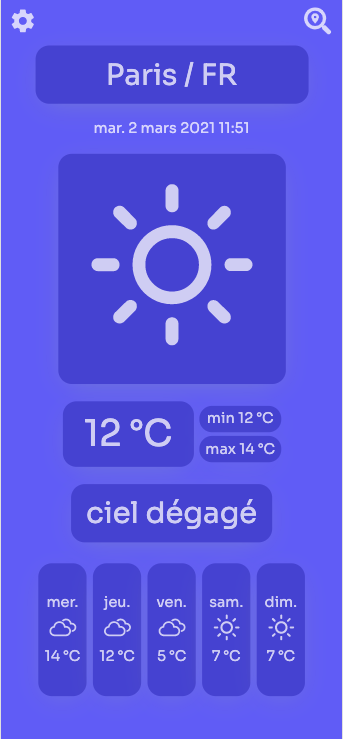

# EasyWeather - WeatherApp

Simple weather app created with React and Sass

# Introduction 

This application consists of telling us the weather forecast at the location of our choice, first of all the application allows you to see the weather forecast at your location and then to search by city if you wish.



# Technologies

  - [React](https://reactjs.org/ "React's Homepage")
  - [Redux](https://redux.js.org/ "Redux's Homepage")
  - [Sass](https://www.npmjs.com/package/node-sass)
  - [Axios](https://github.com/axios/axios)
  - [MomentJS](https://momentjs.com/) & [MomentTimeZone](https://momentjs.com/timezone/)

 - ### API
 - [Openweather](https://openweathermap.org/forecast5 "OpenWeatherMap's Doc")
 - [Ipapi](https://openweathermap.org/forecast5 "Ipapi's Homepage")

# Launch

In the terminal 
```
yarn
```
then run
```
yarn start
```

Enjoy !